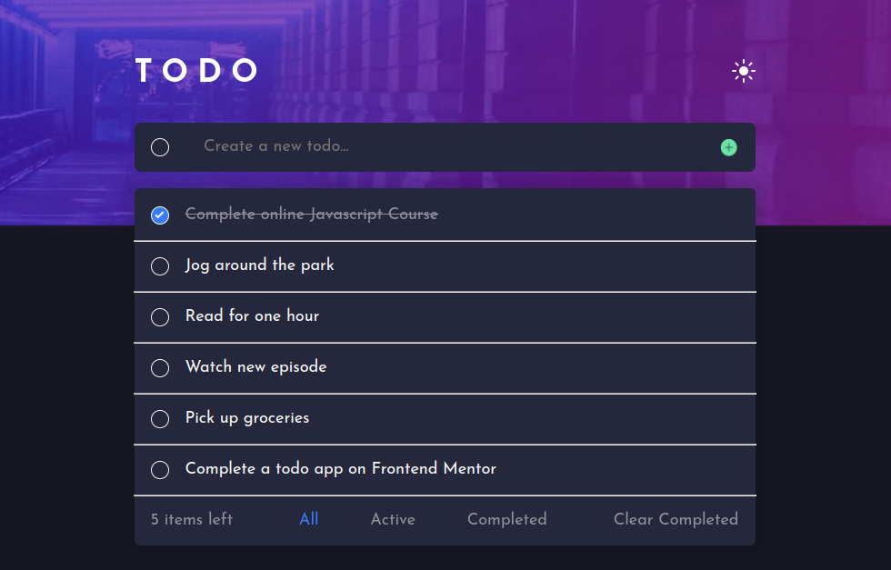

# Frontend Mentor - Todo app solution

This is a solution to the [Todo app challenge on Frontend Mentor](https://www.frontendmentor.io/challenges/todo-app-Su1_KokOW). Frontend Mentor challenges help you improve your coding skills by building realistic projects.

## Table of contents

- [Overview](#overview)
  - [The challenge](#the-challenge)
  - [Screenshot](#screenshot)
  - [Links](#links)
- [My process](#my-process)
  - [Built with](#built-with)
  - [What I learned](#what-i-learned)
  - [Continued development](#continued-development)
  - [Useful resources](#useful-resources)
- [Author](#author)
- [Acknowledgements](#acknowledgements)

## Overview

### The challenge

Users should be able to:

- View the optimal layout for the app depending on their device's screen size ✅
- See hover states for all interactive elements on the page ✅
- Add new todos to the list ✅
- Mark todos as complete ✅
- Delete todos from the list ✅
- Filter by all/active/complete todos ✅
- Clear all completed todos ✅
- Toggle light and dark mode ✅
- **Bonus**: Drag and drop to reorder items on the list ✅

### Screenshot




### Links

This app is deployed using Vercel

- Solution URL: [https://www.frontendmentor.io/solutions/responsive-todo-app-built-using-react-1EJR5nNYqw](https://www.frontendmentor.io/solutions/responsive-todo-app-built-using-react-1EJR5nNYqw)
- Live Site URL: [https://todo-app-ten-eta.vercel.app/](https://todo-app-ten-eta.vercel.app/)

## My process

### Built with

- Semantic HTML5 markup
- CSS custom properties
- Flexbox
- CSS Grid
- Mobile-first workflow
- [React](https://reactjs.org/) - JS library

### What I learned

In this project, I learnt how to use the useEffect hook with local storage. I also learnt to initialize state from local storage.

```js
const [todos, setTodos] = useState(
  () => JSON.parse(localStorage.getItem("todoItems")) || []
);

useEffect(() => {
  localStorage.setItem("todoItems", JSON.stringify(todos));
}, [todos]);
```

### Continued development

I plan on making this app a fullstack CRUD app by integrating it with firebase.

### Useful resources

- [scrimba](https://www.scrimba.com) - This is in my opinion the best place to learn web development.
- [backgrounImage](https://www.freecodecamp.org/news/react-background-image-tutorial-how-to-set-backgroundimage-with-inline-css-style/) - This is an amazing article which helped me finally understand how to set inline background image style. I'd recommend it to anyone still learning this concept.
- [stack overflow](https://stackoverflow.com/) - Whenever I got stuck, I always found some insight here.

## Author

- Website - [tanuikiprop](https://www.tanuikiprop.gq/)
- Frontend Mentor - [@kiprop-dave](https://www.frontendmentor.io/profile/kiprop-dave)

## Acknowledgements

I learnt how to drag items in a list from [this video](https://www.youtube.com/watch?v=CYKDtVZr_Jw&list=PLmIrBYSMth7g2jdEQLucaclCuC81EjzBp&index=3&ab_channel=Bikashweb)
